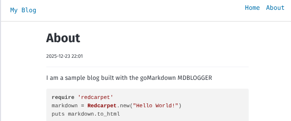

# 🚀 MarkDown Blogger

A dead-simple, lightweight Markdown-to-blog framework written in **pure Go**. No bloated JavaScript frameworks, no complex databases, and no heavy dependencies.

Just point it at a folder of Markdown files, and your blog is live instantly.



## ✨ Features

- **Zero-Config Ready:** Runs straight out of the box.
- **Automatic Discovery:** Any `.md` file in your content folder becomes a post.
- **Obsidian-Style Assets:** Supports `[[image.png]]` syntax for easy linking.
- **Hot Reloading:** Built-in watcher refreshes your blog as you edit files.
- **Environment Friendly:** Configure via CLI flags or Environment Variables.
- **Minimalist:** High performance with a tiny memory footprint.

---

## 🛠️ Installation

Ensure you have [Go](https://go.dev/doc/install) installed, then clone this repository:

```bash
git clone https://github.com/youruser/gomarkdown-blog.git
cd gomarkdown-blog

```

---

## 🚀 Quick Start

To host your blog from a specific directory:

```bash
go run main.go -path /home/user/blog/content

```

Visit `http://localhost:8080` to see your blog.

---

## 📂 Content Structure

Organize your content folder like this:

```text
content/
├── assets/          # Put all images/files here
│   ├── cat.png
│   └── dog.png
├── post1.md         # Visible at /blog/post1
├── post2.md         # Visible at /blog/post2
└── about.md         # Special page visible at /about

```

### Linking Images

This framework supports **Obsidian-style internal linking**. To display an image from your `assets/` folder inside a Markdown post, use:

```markdown
# My First Post

Check out my cat:
[[cat.png]]
```

### The "About" Page

To create an "About Me" section, simply create an `about.md` file in your root content directory. It will be served at the `/about` URL path and behaves exactly like a standard post.

---

## ⚙️ Configuration

You can configure the server using CLI flags or Environment Variables. **Flags always take precedence over environment variables.**

| Flag        | Env Variable    | Default     | Description                          |
| ----------- | --------------- | ----------- | ------------------------------------ |
| `-path`     | `BLOG_PATH`     | (Required)  | Path to your Markdown content folder |
| `-port`     | `BLOG_PORT`     | `8080`      | Port to host the server on           |
| `-host`     | `BLOG_HOST`     | `127.0.0.1` | Use `0.0.0.0` for public access      |
| `-watcher`  | `BLOG_WATCHER`  | `true`      | Enable hot reload on file changes    |
| `-template` | `BLOG_TEMPLATE` | `templates` | Path to custom HTML templates        |

### Example with Flags

```bash
go run . -path ./content -port 9000 -host 0.0.0.0

```

---

## 🎨 Customizing Templates

The blog uses pure HTML templates located in the `templates/` folder. You can modify these to change the look and feel without needing to recompile the Go binary.

The structure includes a `list` definition for the homepage and a `post` definition for individual articles.

---

## ⚡ Performance & Resource Usage

This framework is built for speed and efficiency. Below are the results of a stress test performed on a standard development machine (Pop!\_OS 22.04).
Ultra 7 155U: 12 Cores (2P, 8E, 2LPE), 14 Threads, up to 4.8GHz.
Test is running localhost.

### Benchmarks

Tested using `wrk` with 100 concurrent connections over 30 seconds:

```bash
wrk -c 100 -d 30 -t 5 http://localhost:8080/blog/about

```

| Metric             | Value                   |
| ------------------ | ----------------------- |
| **Throughput**     | **96,085 requests/sec** |
| **Latency (Avg)**  | **1.40 ms**             |
| **Transfer Rate**  | **207.09 MB/sec**       |
| **Total Requests** | **2.89 Million**        |

### Resource Footprint

Measured using `ps` during peak load to determine the physical memory (RSS) impact:

| Resource          | Usage        |
| ----------------- | ------------ |
| **Idle RAM**      | **~12 MB**   |
| **Peak Load RAM** | **~19.5 MB** |
| **CPU (Idle)**    | **< 0.1%**   |

### Why it's so efficient

- **Low Memory Overhead:** Uses only ~20MB of RAM even when serving nearly 100k requests per second. You can run this on the smallest VPS (DigitalOcean Droplet, AWS Nano, etc.) with zero issues.
- **No Interpreter:** Being a compiled Go binary, there is no heavy JavaScript engine (V8) or Python interpreter eating up your memory.
- **Goroutines:** Every connection is handled by a lightweight Goroutine (~2KB each) rather than a heavy OS thread.

---

### How to Reproduce

To run your own resource check, use the following commands while the server is under load:

**Memory check:**

```bash
ps -C blogger -o pid,rss,comm,pmem

```

**Load test:**

```bash
wrk -c 100 -d 30 -t 5 http://localhost:8080/

```

---

## 📜 License

Distributed under the MIT License. See `LICENSE` for more information.
